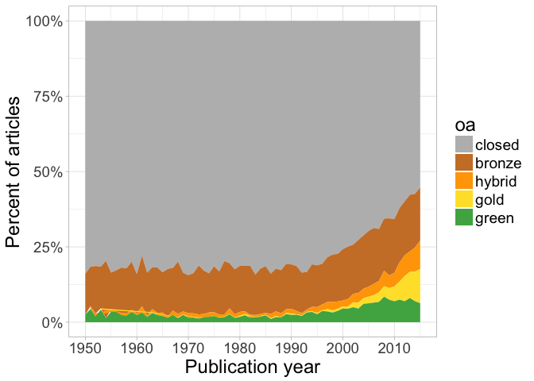
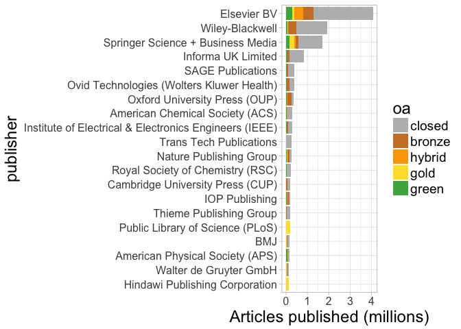
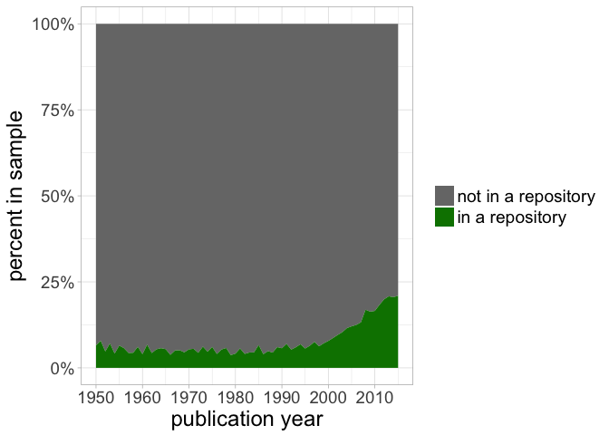
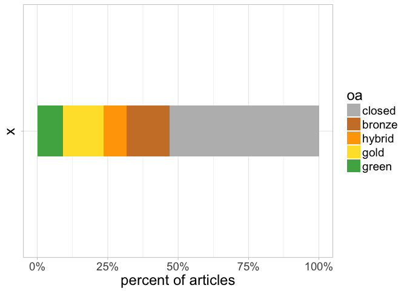

OA paper
================
many

Results outline so far: - How accurate is our OA detection (from Juan, modified to use hybrid analysis) - How much OA is there? - How is open access changing over time? - How do OA patterns vary across publishers? - Which repositories contribute most to OA availability? - How do OA patterns vary by discipline? - How much OA is there in most highly-accessed papers? - Do different types of OA have different citation patterns?

\# How much OA is there?
========================

``` r
articles_all %>% count(oa) %>% mutate(proportion=n/sum(n))
```

    ## # A tibble: 6 × 3
    ##       oa     n   proportion
    ##   <fctr> <int>        <dbl>
    ## 1 closed 72029 0.7214081827
    ## 2 bronze 16202 0.1622715209
    ## 3 hybrid  3550 0.0355551104
    ## 4   gold  3219 0.0322399720
    ## 5  green  4816 0.0482347639
    ## 6     NA    29 0.0002904502

``` r
kable(articles_all %>% count(oa) %>% mutate(percent=round(100*n/sum(n),1)))
```

| oa     |      n|  percent|
|:-------|------:|--------:|
| closed |  72029|     72.1|
| bronze |  16202|     16.2|
| hybrid |   3550|      3.6|
| gold   |   3219|      3.2|
| green  |   4816|      4.8|
| NA     |     29|      0.0|

``` r
# just 2015
articles_all %>% filter(year==2015) %>% count(oa) %>% mutate(proportion_2015=n/sum(n))
```

    ## # A tibble: 5 × 3
    ##       oa     n proportion_2015
    ##   <fctr> <int>           <dbl>
    ## 1 closed  2608      0.55277660
    ## 2 bronze   832      0.17634591
    ## 3 hybrid   445      0.09431963
    ## 4   gold   535      0.11339551
    ## 5  green   298      0.06316236

``` r
kable(articles_all %>% filter(year==2015) %>% count(oa) %>% mutate(proportion_2015=round(100*n/sum(n),1)))
```

| oa     |     n|  proportion\_2015|
|:-------|-----:|-----------------:|
| closed |  2608|              55.3|
| bronze |   832|              17.6|
| hybrid |   445|               9.4|
| gold   |   535|              11.3|
| green  |   298|               6.3|

``` r
proportions_2015 = articles_all %>% filter(year==2015) %>% count(oa) %>% mutate(proportion_2015=round(100*n/sum(n),1))
n_2015 = c(2608, 832+445+535+298)
n_2015_ci = BinomCI(n_2015, sum(n_2015),
        conf.level = 0.95,
        method = "clopper-pearson")
100*round(n_2015_ci, 3)
```

    ##       est lwr.ci upr.ci
    ## [1,] 55.3   53.8   56.7
    ## [2,] 44.7   43.3   46.2

``` r
n_2015_multi = c(2608, 832, 445, 535, 298)
100*round(MultinomCI(n_2015_multi, 
           conf.level=0.95, 
           method="sisonglaz"), 3)
```

    ##       est lwr.ci upr.ci
    ## [1,] 55.3   53.9   56.7
    ## [2,] 17.6   16.2   19.1
    ## [3,]  9.4    8.0   10.9
    ## [4,] 11.3    9.9   12.8
    ## [5,]  6.3    4.9    7.8

``` r
# binomial for open vs closed
unpaywall_dois = 100000 * c(47, 53)/100
unpaywall_ci = BinomCI(unpaywall_dois, sum(unpaywall_dois),
        conf.level = 0.95,
        method = "clopper-pearson")
100*round(unpaywall_ci, 3)
```

    ##      est lwr.ci upr.ci
    ## [1,]  47   46.7   47.3
    ## [2,]  53   52.7   53.3

``` r
# multinomial for the types of open
unpaywall_dois_types = 100000 * c(15.3,8.3,14.3,9.1, 53)/100
100*round(MultinomCI(unpaywall_dois_types, 
           conf.level=0.95, 
           method="sisonglaz"), 3)
```

    ##       est lwr.ci upr.ci
    ## [1,] 15.3   15.0   15.6
    ## [2,]  8.3    8.0    8.6
    ## [3,] 14.3   14.0   14.6
    ## [4,]  9.1    8.8    9.4
    ## [5,] 53.0   52.7   53.3

Category definitions:

-   *closed*: We could not find a free fulltext copy.
-   *bronze*: Free-to-read on the publisher page, with no license we could find.
-   *hybrid*: Free-to-read on the publisher page, published under some kind of open license.
-   *gold* Free-to-read on the publisher page, and listed as open according to the DOAJ.
-   *green*: The article is Green OA. We couldn't find any free copy on the publisher page, but we did find one in a repository. Note: this category is for copies that are *only* available in the repository, nowhere else.
-   *NA*: Processing error of some kind

So, about 28% of the DOI-assigned literature is available to read. Given that there are 66,560,153 total journal articles with a Crossref DOI (from <http://api.crossref.org/works?filter=type:journal-article>), that means we can estimate there are *at least* 66560153 \* 0.279 = 18570283 free-to-read articles (18.6 million) with Crossref DOIs.

But we know that in recent years OA has been gaining steam, so let's let's look more closely at OA over time.

\# How is open access changing over time?
=========================================

How complete is the publication year data from Crossref?

``` r
articles_all %>% group_by(year <= 2017 & year >= 1500) %>% summarise(n())
```

    ## # A tibble: 3 × 2
    ##   `year <= 2017 & year >= 1500` `n()`
    ##                           <lgl> <int>
    ## 1                         FALSE     4
    ## 2                          TRUE 99411
    ## 3                            NA   430

It seems the year data is pretty good, with less than 0.1% missing or obviously wrong years. We don't really want to look at data since 1500, so let's see what's a reasonable window to examine. We'll try 1950 because it's well before the "modern era" of open access.

``` r
###############
# HAP exploring
# looking into bronze
crossref_bronze_2016 = articles_all %>% filter(oa=="bronze", year==2016)
write.csv(crossref_bronze_2016, file="crossref_bronze_2016.csv", row.names=TRUE)
```

``` r
# subset by time
articles_all %>% filter(year >= 1950 & year <= 2017) %>%
    ggplot(aes(x=year)) + geom_bar(width=1) + 
    scale_x_continuous(name="publication year", limits=c(1950, 2017), 
                       breaks = c(2017, seq(1950, 2015, by = 10))) +
    scale_y_continuous(name="count in sample") + this_theme
```


The DOI sample was taken in early 2017, so unsurprisingly, we do not yet have enough DOIs from 2017 to plot. More surprisingly, 2016 seems to be underrepresented as well. Publishers can be slow to deposit information with Crossref, and this is likely the cause. So, we'll remove 2017 and 2016 from our timeseries subset.

Here's the version from 1950-2015:

``` r
articles_all = articles_all %>% mutate(is_modern = year >= 1950 & year <= 2015)

articles_all %>% count(is_modern) %>% mutate(proportion = n / sum(n))
```

    ## # A tibble: 3 × 3
    ##   is_modern     n  proportion
    ##       <lgl> <int>       <dbl>
    ## 1     FALSE 10691 0.107075968
    ## 2      TRUE 88724 0.888617357
    ## 3        NA   430 0.004306675

This modern subset will 89% of all DOIs ever, while letting us zoom in on the years of interest.

We'll start with plotting absolute numbers of OA articles:

``` r
population_scaling_factor =  66560153 / 100000  # population size divided by sample size
oa_years = articles_all %>% 
    filter(is_modern) %>%
    count(year, oa) %>%
    mutate(pop_millions = n * population_scaling_factor / 1000000)  

oa_years %>% ggplot(aes(x=year, fill=oa, y=pop_millions)) + 
    geom_bar(stat="identity", width = 1) +
    scale_x_continuous(name="Publication year",  breaks = c(seq(1950, 2015, by = 10))) +
    scale_y_continuous(name="Total articles (millions)") +   
    oa_color_map + 
    this_theme    
```


We can see the OA count is growing. How many articles published in 2015 (the last year we have complete data for) were OA?

``` r
oa_years %>% filter(year == 2015, oa != "closed") %>% 
    summarise(open_2015_millions = sum(pop_millions))
```

    ## # A tibble: 1 × 2
    ##    year open_2015_millions
    ##   <int>              <dbl>
    ## 1  2015           1.404419

We can see the absolute number of free-to-read articles of all kinds is growing significantly. However, we're particularly interested in the by-year *proportion* of the literature that is free to read.

``` r
# see http://stackoverflow.com/questions/24576515/relative-frequencies-proportions-with-dplyr
oa_freq_by_year = articles_all %>% filter(is_modern) %>% count(year, oa) %>%  
  mutate(perc = n / sum(n)) %>%  
  ungroup()  

oa_freq_by_year %>% ggplot(aes(x=year, y=perc, fill=oa)) + geom_area() + 
    scale_x_continuous(name="Publication year", limits=c(1950, 2015), 
                       breaks = c(seq(1950, 2015, by = 10))) +
    scale_y_continuous(name="Percent of articles", labels=percent) +
    oa_color_map + this_theme
```



The proportion of OA is growing, too--not just the absolute amounts. This is driven the three Gold categories, all three of which are increasing over time. The percentage of Green Only OA is showing modest declines. Note that this doesn't necessarily reflect the number of papers actually being deposited, since this category is for papers available *only* in a repository. Gold-and-green articles are categorized as Gold. This means that growth in Gold may be disguising growth in the percentage of self-archived papers. We'll look more into this possibility further below. For now, thought, we turn to publishers.

\# Publishers
=============

It's interesting to see how openness looks when broken down by publisher. To do this, we'll subset the years more tightly and just look at articles since 2009. This will let us look at the more up-to-date picture that may include OA publishers.

``` r
articles_recent = articles_all %>% filter(is_modern, year >= 2009)
articles_recent$publisher = fct_infreq(articles_recent$publisher)

publishers = articles_recent %>% count(publisher) %>%
  ungroup()

# the top 20 publishers publish 82% of articles.
sum(publishers$n[0:82]) /sum(publishers$n)
```

    ## [1] 0.8194016

``` r
publishers_oa = articles_recent %>% 
    count(publisher, oa) %>%
    mutate(pop_n_millions = n * population_scaling_factor / 1000000) %>%
    ungroup()

temp_theme = theme(text = element_text(size=18), 
                   axis.text.x = element_text(size=12), 
                   axis.text.y = element_text(size=12))


publishers_oa %>% slice(1:83) %>% mutate(publisher_rev=fct_rev(publisher)) %>% 
    ggplot(aes(x=publisher_rev, y=pop_n_millions, fill=oa)) + 
    geom_bar(stat="identity") + 
    coord_flip() +
    scale_x_discrete(name="publisher") +
    scale_y_continuous(name="Articles published (millions)") +
    oa_color_map + temp_theme
```



``` r
publishers_oa %>% slice(1:83) %>% mutate(publisher_rev=fct_rev(publisher)) %>% ggplot(aes(x=publisher_rev, y=n, fill=oa)) + 
  geom_bar(stat="identity", position="fill") + 
  coord_flip() +
    scale_x_discrete(name="publisher") +
    scale_y_continuous(name="Percent of articles", labels=percent) +
  oa_color_map + temp_theme
```


From this we can see that Elsevier is massively outpublishing anyone else. Because of this, they are also publishing more open-access content than any other single publisher. However, in percentage terms other publshers are doing much better at making content open. Unsurprisingly, the American Physical Society stands out as having more Green OA than other publishers in percentage terms, because of the prevelance of the ArXiv in Physics. PLOS and Hindawi stand out as the only open-access-only publishers in the list of top publishers.

\# Repositories
===============

+A different question is to dig into which repositories are contributing to making papers available. Let's take a look at PubMed Central in particular, since it has become the most important single source of Green OA. We'll lump all the other repositories (about 5000 of them) in a separate category and plot the results. As a reminder, we are only looking here at articles that are *only* available from a green repository:

``` r
    # articles_all = articles_all %>% mutate(base_collection_string=as.character(green_base_collections))
    # 
    # articles_all$repo = NULL
    # articles_all$repo[articles_all$oa=="green"] = "other"
    # articles_all$repo[grepl('/pmc/', articles_all$best_open_url)] = "PMC"
    # articles_all$repo[grepl('arxiv.org', articles_all$best_open_url)] = "arXiv"
    # articles_all$repo[grepl('.edu', articles_all$best_open_url)] = ".edu"
    # 
    # repo_ordered_levels = c("PMC", "arXiv", ".edu", "other")
    # articles_all = mutate(articles_all, repo=factor(repo, levels=repo_ordered_levels))
    # 
    # articles_all %>% filter(is_modern) %>% filter(!is.na(repo)) %>% ggplot(aes(x=year, fill=repo)) +
    #     geom_bar(width=1) + scale_fill_brewer(palette="Set3") + 
    #     scale_x_continuous(name="publication year", limits=c(1950, 2015), 
    #                        breaks = c(seq(1950, 2015, by = 10))) +
    #     scale_y_continuous(name="count in sample") + this_theme
```

It apprears that multi-year embargoes maybe affecting PMC, since the number of articles shows a surprising drop in the last few years. However despite this, we see that PMC remains by far the most significant green repository, particularly for papers published in the last decade.

``` r
# articles_all %>% filter(is_modern, oa=="green") %>% count(repo) %>% mutate(proportion=n/sum(n))
# kable(articles_all %>% filter(is_modern, oa=="green") %>% count(repo) %>% mutate(percent=round(100*n/sum(n),1)))
```

That said, smaller repositories are still making a significant contribution to Green OA, particularly in recent years. for articles published since 2009, the contribute about as much as PMC (42%).

Growth in literature over time with any green
---------------------------------------------

We are only counting something as "green" if it's not available in any other format (Gold, hybrid). However, it's also interesting to look at how many articles are available in a repository, regardless of where else they might be open. Let's take a look at that below:

``` r
gray_green_color_map = scale_fill_manual(values=c("#777777", "#008000", "#FFD700"), 
                                         name="", 
                                         labels=c("not in a repository", "in a repository"))

articles_all %>% filter(is_modern) %>% ggplot(aes(x=year, fill=found_green)) + geom_bar(width=1) +
    gray_green_color_map + 
    scale_x_continuous(name="publication year", limits=c(1950, 2015), 
                       breaks = c(seq(1950, 2015, by = 10))) +
    scale_y_continuous(name="count in sample") + this_theme
```

 As a proportion of all articles, deposits into repositories has been going up, with a recent drop. Embargos probaby play a large part in this, though deposit into places like ResearchGate (not included in our repository numbers) rather than institutional repositories may as well.

``` r
found_green_freq_by_year = articles_all %>% filter(is_modern) %>% count(year, found_green) %>%
  mutate(perc = n / sum(n)) %>%
  ungroup()
found_green_freq_by_year %>% ggplot(aes(x=year, y=perc, fill=found_green)) + geom_area() +
    gray_green_color_map + 
    scale_x_continuous(name="publication year", limits=c(1950, 2015), 
                       breaks = c(seq(1950, 2015, by = 10))) +
    scale_y_continuous(name="percent in sample", labels=percent) + this_theme
```



\# By license
=============

What are the most common licenses for open-access papers?

``` r
articles_all %>% filter(year >= 2009 & year <= 2015) %>% summary()
```

    ##                               doi       
    ##  10.1001/archderm.148.11.1318-c :    1  
    ##  10.1001/archdermatol.2011.326-a:    1  
    ##  10.1001/archinternmed.2011.344 :    1  
    ##  10.1001/archinternmed.2011.552 :    1  
    ##  10.1001/archneurol.2010.297    :    1  
    ##  10.1001/archneurol.2010.359    :    1  
    ##  (Other)                        :27868  
    ##                                                   evidence    
    ##  closed                                               :16758  
    ##  hybrid (via free pdf)                                : 5047  
    ##  oa journal (via journal title in doaj)               : 2173  
    ##  oa repository (via BASE title and first author match): 1049  
    ##  hybrid (via page says license)                       :  917  
    ##  hybrid (via crossref license)                        :  820  
    ##  (Other)                                              : 1110  
    ##  oa_color_long 
    ##  bronze: 5047  
    ##  closed:16760  
    ##  gold  : 2193  
    ##  gray  :    0  
    ##  green : 1987  
    ##  hybrid: 1887  
    ##                
    ##                                                                               best_open_url  
    ##                                                                                      :16760  
    ##  http://ntur.lib.ntu.edu.tw/news/agent_contract.pdf                                  :    5  
    ##  http://journals.lww.com/jwhpt/Documents/JOWHPT_CALL_FOR_PAPERS.pdf                  :    2  
    ##  http://militarymedicine.amsus.org/pb-assets/Sample Documents/AMSUSBeAnAuthor2016.pdf:    2  
    ##  https://www.ncbi.nlm.nih.gov/pmc/articles/PMC2560007/pdf                            :    2  
    ##  http://19.bbk.ac.uk/articles/10.16995/ntn.588/galley/601/download/                  :    1  
    ##  (Other)                                                                             :11102  
    ##       year      found_green                                journal     
    ##  Min.   :2009   Mode :logical   ChemInform                     :  491  
    ##  1st Qu.:2010   FALSE:22507     PLoS ONE                       :  233  
    ##  Median :2012   TRUE :5367      Advanced Materials Research    :  202  
    ##  Mean   :2012                   Applied Mechanics and Materials:  143  
    ##  3rd Qu.:2014                   Cancer Res                     :   78  
    ##  Max.   :2015                   Reactions Weekly               :   77  
    ##                                 (Other)                        :26650  
    ##                                      publisher    
    ##  Elsevier BV                              : 6100  
    ##  Wiley-Blackwell                          : 2899  
    ##  Springer Science + Business Media        : 2536  
    ##  Informa UK Limited                       : 1263  
    ##  SAGE Publications                        :  605  
    ##  Ovid Technologies (Wolters Kluwer Health):  591  
    ##  (Other)                                  :13880  
    ##                                license          random         
    ##                                    :23753   Min.   :0.0000000  
    ##  cc-by                             : 2216   1st Qu.:0.0004000  
    ##  cc-by-nc-nd                       :  670   Median :0.0008000  
    ##  cc-by-nc                          :  636   Mean   :0.0007918  
    ##  elsevier-specific: oa user license:  343   3rd Qu.:0.0012000  
    ##  cc-by-nc-sa                       :  162   Max.   :0.0016000  
    ##  (Other)                           :   94                      
    ##  is_open_license      oa        is_modern     
    ##  Mode :logical   closed:16760   Mode:logical  
    ##  FALSE:24113     bronze: 5047   TRUE:27874    
    ##  TRUE :3761      hybrid: 1887                 
    ##                  gold  : 2193                 
    ##                  green : 1987                 
    ##                                               
    ## 

``` r
articles_all %>% filter(year >= 2009 & year <= 2015) %>% filter(license != "") %>% summary()
```

    ##                               doi      
    ##  10.1001/jamafacial.2013.223    :   1  
    ##  10.1001/jamainternmed.2013.9043:   1  
    ##  10.1002/acr.22392              :   1  
    ##  10.1002/ajmg.a.37172           :   1  
    ##  10.1002/ajmg.b.32346           :   1  
    ##  10.1002/anie.201405442         :   1  
    ##  (Other)                        :4115  
    ##                                                   evidence   
    ##  oa journal (via journal title in doaj)               :2173  
    ##  hybrid (via page says license)                       : 916  
    ##  hybrid (via crossref license)                        : 820  
    ##  hybrid (via free pdf)                                : 115  
    ##  oa repository (via BASE title and first author match):  63  
    ##  oa repository (via BASE doi match)                   :  27  
    ##  (Other)                                              :   7  
    ##  oa_color_long
    ##  bronze: 115  
    ##  closed:   0  
    ##  gold  :2187  
    ##  gray  :   0  
    ##  green :  80  
    ##  hybrid:1739  
    ##               
    ##                                                                      best_open_url 
    ##  http://academicjournals.org/journal/AJAR/article-full-text-pdf/356EAAA52361:   1  
    ##  http://academicjournals.org/journal/AJAR/article-full-text-pdf/AE351DD53642:   1  
    ##  http://academicjournals.org/journal/AJAR/article-full-text-pdf/B92842537248:   1  
    ##  http://academicjournals.org/journal/AJB/article-full-text-pdf/4DDFBEA44269 :   1  
    ##  http://academicjournals.org/journal/AJB/article-full-text-pdf/92E2CD246529 :   1  
    ##  http://academicjournals.org/journal/AJB/article-full-text-pdf/9E54CB033229 :   1  
    ##  (Other)                                                                    :4115  
    ##       year      found_green    
    ##  Min.   :2009   Mode :logical  
    ##  1st Qu.:2011   FALSE:1891     
    ##  Median :2013   TRUE :2230     
    ##  Mean   :2013                  
    ##  3rd Qu.:2014                  
    ##  Max.   :2015                  
    ##                                
    ##                                           journal    
    ##  PLoS ONE                                     : 233  
    ##  Biophysical Journal                          :  45  
    ##  Journal of the American College of Cardiology:  41  
    ##  Procedia - Social and Behavioral Sciences    :  40  
    ##  Scientific Reports                           :  32  
    ##  Journal of Vision                            :  24  
    ##  (Other)                                      :3706  
    ##                              publisher   
    ##  Elsevier BV                      : 764  
    ##  Springer Science + Business Media: 481  
    ##  Public Library of Science (PLoS) : 265  
    ##  Hindawi Publishing Corporation   : 204  
    ##  FapUNIFESP (SciELO)              : 192  
    ##  MDPI AG                          :  91  
    ##  (Other)                          :2124  
    ##                                license         random         
    ##  cc-by                             :2216   Min.   :0.0000000  
    ##  cc-by-nc-nd                       : 670   1st Qu.:0.0004000  
    ##  cc-by-nc                          : 636   Median :0.0008000  
    ##  elsevier-specific: oa user license: 343   Mean   :0.0007885  
    ##  cc-by-nc-sa                       : 162   3rd Qu.:0.0012000  
    ##  cc-by-sa                          :  59   Max.   :0.0016000  
    ##  (Other)                           :  35                      
    ##  is_open_license      oa       is_modern     
    ##  Mode :logical   closed:   0   Mode:logical  
    ##  FALSE:366       bronze: 115   TRUE:4121     
    ##  TRUE :3755      hybrid:1739                 
    ##                  gold  :2187                 
    ##                  green :  80                 
    ##                                              
    ## 

``` r
# percent of open access articles with a license:
4115/27868
```

    ## [1] 0.1476604

``` r
# now limit to just Creative Commons licenses
articles_all %>% filter(year >= 2009 & year <= 2015) %>% filter(grepl('cc', license)) %>% ggplot(aes(x=year, fill=license)) + geom_bar(width=1, position="fill") +
    scale_fill_brewer(palette="Set3") + 
    scale_x_continuous(name="publication year") +
    scale_y_continuous(name="papers with licenses", labels=percent) + this_theme
```


It looks like there has been steady growth in the number of articles licensed with the CC-BY license, largely at the expense of the CC-BY-NC license.

\# How much OA is there for most-accessed papers?
=================================================

DOIs accessed through Unpaywall during the week of XXX XX accesses, XXX unique DOIs, XXXX unique IP addresses. Selected random accesses until had 100k distinct DOIs

NOTE THIS GOES UP TO 2017, SEEMS RELEVANT

``` r
articles_accessed_raw <- read.csv("unpaywall_100k.csv")
articles_accessed = articles_accessed_raw 
articles_accessed = mutate(articles_accessed, oa=factor(oa_color_long, levels=oa_ordered_levels))
articles_accessed = mutate(articles_accessed, oa=fct_recode(oa, "bronze"="bronze", "hybrid"="hybrid", "gold"="gold", "green"="green"))
articles_accessed = articles_accessed %>% filter(!is.na(oa))
# how much oa
kable(articles_accessed %>% count(oa) %>% mutate(percent=round(100*n/sum(n),1)))
```

| oa     |      n|  percent|
|:-------|------:|--------:|
| closed |  55944|     53.0|
| bronze |  16136|     15.3|
| hybrid |   8736|      8.3|
| gold   |  15138|     14.3|
| green  |   9661|      9.1|

``` r
#unpaywall sample
articles_accessed %>% filter(!is.na(oa)) %>% ggplot(aes(x="", fill=oa)) + 
  geom_bar(position="fill", width=0.2) + 
  coord_flip() +
  oa_color_map + 
    scale_y_continuous(name="percent of articles", labels=percent) + this_theme
```



``` r
# whole sample
articles_all %>% filter(!is.na(oa)) %>% filter(year<=2015) %>% ggplot(aes(name="", x="", fill=oa)) + 
  geom_bar(position="fill", width=0.2) + 
  coord_flip() +
  oa_color_map + 
    scale_y_continuous(name="percent of articles", labels=percent) + this_theme
```


``` r
# number of articles in last two years in Unpaywall sample
articles_accessed %>% group_by(year <= 2017 & year >= 2015) %>% summarise(n())
```

    ## # A tibble: 3 × 2
    ##   `year <= 2017 & year >= 2015` `n()`
    ##                           <lgl> <int>
    ## 1                         FALSE 52205
    ## 2                          TRUE 52341
    ## 3                            NA  1069

Confidence intervals

unpaywall sample

``` r
# binomial for open vs closed
unpaywall_dois = 100000 * c(47, 53)/100
unpaywall_ci = BinomCI(unpaywall_dois, sum(unpaywall_dois),
        conf.level = 0.95,
        method = "clopper-pearson")
100*round(unpaywall_ci, 3)
```

    ##      est lwr.ci upr.ci
    ## [1,]  47   46.7   47.3
    ## [2,]  53   52.7   53.3

``` r
# multinomial for the types of open
unpaywall_dois_types = 100000 * c(15.3,8.3,14.3,9.1, 53)/100
100*round(MultinomCI(unpaywall_dois_types, 
           conf.level=0.95, 
           method="sisonglaz"), 3)
```

    ##       est lwr.ci upr.ci
    ## [1,] 15.3   15.0   15.6
    ## [2,]  8.3    8.0    8.6
    ## [3,] 14.3   14.0   14.6
    ## [4,]  9.1    8.8    9.4
    ## [5,] 53.0   52.7   53.3

crossref sample

``` r
# crossref sample
# binomial for open vs closed
crossref_dois = 100000 * c(27.9,72)/100
crossref_ci = BinomCI(crossref_dois, sum(crossref_dois),
        conf.level = 0.95,
        method = "clopper-pearson")
100*round(crossref_ci, 3)
```

    ##       est lwr.ci upr.ci
    ## [1,] 27.9   27.6   28.2
    ## [2,] 72.1   71.8   72.4

``` r
# extrapoloation estimate to all of crossref
crossref_ci[1,] * 66560153
```

    ##      est   lwr.ci   upr.ci 
    ## 18588872 18403792 18774804

``` r
# multinomial for the types of open
crossref_dois_types = 100000 * c(16.2,3.6,3.2,4.8,72)/100
100*round(MultinomCI(crossref_dois_types, 
           conf.level=0.95, 
           method="sisonglaz"), 3)
```

    ##       est lwr.ci upr.ci
    ## [1,] 16.2   16.0   16.5
    ## [2,]  3.6    3.3    3.9
    ## [3,]  3.2    2.9    3.5
    ## [4,]  4.8    4.5    5.1
    ## [5,] 72.1   71.9   72.4

wos sample

``` r
# binomial for open vs closed
wos_dois = 1000000 * c(36.1, 63.9)/100
wos_dois_ci = BinomCI(wos_dois, sum(wos_dois),
        conf.level = 0.95,
        method = "clopper-pearson")
100*round(wos_dois_ci, 3)
```

    ##       est lwr.ci upr.ci
    ## [1,] 36.1   36.0   36.2
    ## [2,] 63.9   63.8   64.0

``` r
# multinomial for the types of open
wos_dois_types = 100000 * c(12.9,4.3,7.4,11.5,63.9)/100
100*round(MultinomCI(wos_dois_types, 
           conf.level=0.95, 
           method="sisonglaz"), 3)
```

    ##       est lwr.ci upr.ci
    ## [1,] 12.9   12.6   13.2
    ## [2,]  4.3    4.0    4.6
    ## [3,]  7.4    7.1    7.7
    ## [4,] 11.5   11.2   11.8
    ## [5,] 63.9   63.6   64.2
